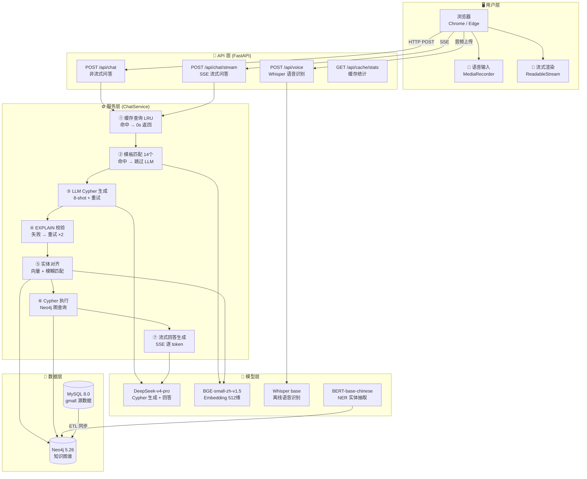
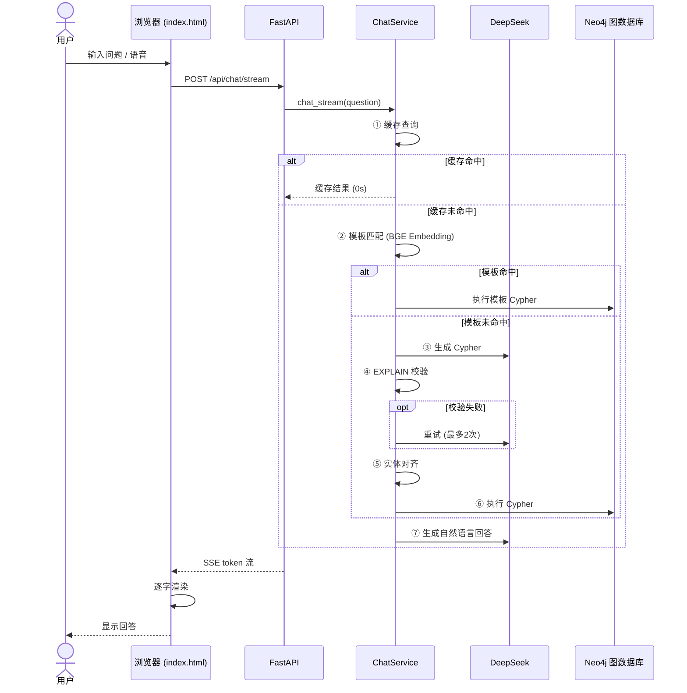

# 🛒 电商知识图谱智能客服系统

> 基于 **知识图谱 + 大语言模型** 的电商智能客服系统，支持自然语言查询、流式响应、语音输入。

<p align="center">
  
  <br>
  <sub>💬 电商知识图谱智能客服 — 主界面</sub>
</p>

---

## 📖 项目简介

本项目构建了一个面向电商场景的智能客服系统，以 **Neo4j 知识图谱** 为数据底座，以 **DeepSeek 大语言模型** 为推理引擎，将用户的自然语言问题自动转换为 Cypher 图查询语句，从知识图谱中检索信息，最终生成自然语言回答。

**核心能力**：`自然语言 → Cypher 图查询 → 知识图谱 → 自然语言回答`

### 亮点

- ⚡ **快速响应**：模板匹配跳过 LLM，常见问题 < 2s；LRU 缓存命中 **0s 响应**
- 🌊 **流式输出**：SSE 逐 token 推送，首字延迟仅 **2-3s**（vs 非流式 8-13s）
- 🎤 **语音输入**：Chrome/Edge 浏览器原生语音识别，支持中文
- 🛡️ **多层容错**：Cypher 语法校验 + 重试 + Fallback 兜底，保障回答质量
- 📊 **可观测性**：缓存统计端点、14 个查询模板、5 个向量索引

---

## 🏗️ 技术架构

### 系统架构



### 请求处理链路



### 技术栈

| 层级 | 技术 | 说明 |
|------|------|------|
| **后端框架** | FastAPI + Uvicorn | 异步 Web 服务 |
| **LLM** | DeepSeek-v4-pro | 通过 langchain_deepseek 调用 |
| **图数据库** | Neo4j 5.26.9 | 知识图谱存储与查询 |
| **嵌入模型** | BGE-small-zh-v1.5 / 512维 | 本地 CPU/GPU 部署 |
| **NER 模型** | BERT-base-chinese 微调 | Token Classification / BIO 标注 |
| **语音识别** | Whisper base | 离线 STT，无需联网 |
| **前端** | Vanilla HTML/CSS/JS | 零框架，marked.js + DOMPurify |
| **编排框架** | LangChain | LLM / Embedding / VectorStore 统一抽象 |
| **配置管理** | python-dotenv | 环境变量管理密钥 |

---

## 📁 项目结构

```
graph/
├── configuration.py              # 中央配置（env-var 优先）
├── src/
│   ├── datasync/                 # 数据同步模块
│   │   ├── table_sync.py         #   MySQL → Neo4j 结构化同步
│   │   ├── text_sync.py          #   NER → Neo4j Tag 同步
│   │   └── utils.py              #   MysqlReader / Neo4jWriter
│   ├── models/ner/               # NER 模型模块
│   │   ├── train.py              #   BERT 微调训练
│   │   ├── predict.py            #   实体预测/提取
│   │   ├── process.py            #   数据预处理/Tokenize
│   │   ├── eval.py               #   模型评估
│   │   └── metrics/seqeval.py    #   seqeval 指标封装
│   └── web/                      # Web 服务模块
│       ├── app.py                #   FastAPI 入口（4 端点）
│       ├── service.py            #   ChatService 核心（935 行）
│       ├── schemas.py            #   Pydantic 模型
│       ├── utils.py              #   索引创建工具
│       └── static/index.html     #   前端界面（842 行）
├── test.py                       # 简单 curl 测试
├── test_improvements.py          # 6 套件自动化测试（860 行）
└── workflows/                    # Claude Code Workflow
    ├── improvement_workflow.js
    └── improvement_workflow_fixed.js
```

---

## 🚀 快速开始

### 环境要求

- **Python** 3.12+
- **Neo4j** 5.x (Community Edition)
- **MySQL** 8.0+
- **ffmpeg**（语音识别需要，conda 安装：`conda install -c conda-forge ffmpeg -n graph`）
- **CUDA** (可选，GPU 加速)

### 1. 克隆项目

```bash
git clone https://github.com/你的用户名/项目名.git
cd 项目名
```

### 2. 安装依赖

```bash
pip install -r requirements.txt
```

### 3. 配置环境变量

创建 `.env` 文件（**切勿提交到 Git**）：

```ini
# Neo4j
NEO4J_URI=bolt://localhost:7687
NEO4J_USER=neo4j
NEO4J_PASSWORD=你的密码
NEO4J_DATABASE=neo4j

# MySQL
MYSQL_HOST=localhost
MYSQL_PORT=3306
MYSQL_USER=root
MYSQL_PASSWORD=你的密码
MYSQL_DATABASE=gmall
MYSQL_CHARSET=utf8mb4

# DeepSeek API
DEEPSEEK_API_KEY=sk-你的API密钥
```

### 4. 下载模型文件

```bash
# 下载 BERT-base-chinese（放入 models/bert-base-chinese/）
# https://huggingface.co/google-bert/bert-base-chinese

# 下载 BGE-small-zh-v1.5（放入 models/bge-small-zh-v1.5/）
# https://huggingface.co/BAAI/bge-small-zh-v1.5
```

或使用项目中的下载脚本：

```bash
python src/models/ner/download_bert.py
```

### 5. 同步数据

```bash
# 结构化数据同步 (MySQL → Neo4j)
python src/datasync/table_sync.py

# 非结构化数据同步 (NER 提取 → Neo4j)
python src/datasync/text_sync.py
```

### 6. 创建向量索引

```bash
python src/web/utils.py
```

### 7. 启动服务

```bash
cd src/web
python app.py
```

访问 **http://localhost:8000** 即可使用。

---

## 📡 API 文档

| 端点 | 方法 | 响应类型 | 说明 |
|------|------|----------|------|
| `/` | GET | Redirect | 重定向到前端页面 |
| `/api/chat` | POST | `application/json` | 非流式问答 |
| `/api/chat/stream` | POST | `text/event-stream` | 流式问答 (SSE) |
| `/api/cache/stats` | GET | `application/json` | 缓存统计 |
| `/api/voice` | POST | `application/json` | 语音 STT（预留） |

### 请求示例

```bash
# 非流式
curl -X POST http://localhost:8000/api/chat \
  -H "Content-Type: application/json" \
  -d '{"message": "有哪些手机品牌？"}'

# 流式
curl -X POST http://localhost:8000/api/chat/stream \
  -H "Content-Type: application/json" \
  -H "Accept: text/event-stream" \
  -d '{"message": "华为有什么产品？"}'
```

---

## 🧠 知识图谱 Schema

### 节点类型（10 种）

| 节点 | 数量 | 说明 |
|------|------|------|
| Category1 | 17 | 一级分类（图书、手机、电脑...） |
| Category2 | 113 | 二级分类 |
| Category3 | 1099 | 三级分类 |
| SPU | 20 | 标准产品单元 |
| SKU | 43 | 库存量单位 |
| BaseTrademark | 15 | 品牌 |
| SaleAttr | 15 | 销售属性 |
| SaleAttrValue | 37 | 销售属性值 |
| BaseAttr | 41 | 规格属性 |
| BaseAttrValue | 129 | 规格属性值 |
| Tag | 51 | NER 提取标签 |

### 关系类型（3 种）

```
(SPU)-[:Belong]->(BaseTrademark)    商品 → 品牌
(SPU)-[:Belong]->(Category3)        商品 → 三级分类
(Category1)-[:Has]->(Category2)     一级 → 二级分类
(Category2)-[:Has]->(Category3)     二级 → 三级分类
(SPU)-[:Have]->(SaleAttr)           商品 → 销售属性
(SaleAttr)-[:Have]->(SaleAttrValue) 销售属性 → 属性值
(SKU)-[:Belong]->(SPU)              SKU → 商品
```

---

## ⚡ 性能优化

| 优化层 | 方案 | 收益 |
|--------|------|------|
| 🚀 **缓存** | LRU OrderedDict / 100 条目 | 命中时 **0s** |
| 📋 **模板** | 14 个 Cypher + Embedding 匹配 | 命中时 **1.5-4s**（跳过 LLM） |
| 🌊 **流式** | SSE / 逐 token 渲染 | 首字 **2-3s** |
| 🎯 **GPU** | CUDA 自动检测 | 嵌入计算 -0.5~1s |
| 🔍 **索引** | 5 个 Hybrid Search 索引 | 实体对齐加速 |

### 效果对比

| 指标 | 优化前 | 优化后 |
|------|--------|--------|
| 常见问题响应 | 8-13s | **< 2s** |
| 复杂问题首字 | 8-13s | **2-3s** |
| 缓存命中 | N/A | **0s** |
| Cypher 成功率 | ~70% | **> 90%** |

---

## 🧪 测试

项目包含 6 套件自动化测试（`test_improvements.py`，860 行），覆盖：

1. **流式端点** — SSE 事件接收 / [DONE] 标记 / Content-Type
2. **模板匹配** — 10 个常见问题快速路径
3. **缓存** — 重复查询加速 + 统计端点
4. **错误处理** — 格式错误 / 空消息 / 超长消息 / 404
5. **语音接口** — 端点可访问 / JSON 格式
6. **向后兼容** — 原始 `/api/chat` 端点

```bash
# 先启动服务，再运行测试
python test_improvements.py
```

---

## 📸 截图展示

### 💬 基础对话界面

<p align="center">
  
</p>

输入自然语言问题，系统自动生成 Cypher 图查询 → 返回结构化回答。

---

### 🌊 流式响应（GIF）

<p align="center">
  
</p>

SSE 逐 token 推送，**首字延迟仅 2-3 秒**，用户无需等待完整响应即可开始阅读。

---

### ⚡ 缓存命中

<p align="center">
  
</p>

相同问题再次查询，LRU 缓存直接返回，**响应时间 0 秒**。

---

### 🎤 语音输入（GIF）

<p align="center">
  
</p>

点击麦克风录音 → 后端 Whisper 离线转文字 → 自动填入输入框并发送。

---

## 🔮 后续规划

- [ ] 多轮对话记忆（Conversation History）
- [ ] 语义缓存（Semantic Cache）升级
- [ ] 意图路由 Agent（Multi-Agent 协作）
- [ ] 用户反馈机制（👍👎）
- [ ] 分析看板（Dashboard）
- [ ] GraphRAG 增强检索
- [ ] 多模态商品搜索（文本 + 图片）
- [ ] PWA 移动端适配

---

## ⚠️ 安全提醒

- `.env` 文件包含所有密钥，**切勿提交到 Git**
- `apikey.env` 包含 API Key，**切勿提交到 Git**
- 模型文件（`models/`）体积较大，请通过 HuggingFace 下载
- 定期更换 API Key 和数据库密码

---

## 📄 License

MIT License — 详见 [LICENSE](LICENSE) 文件。

---

<p align="center">
  <sub>Built with ❤️ using FastAPI + LangChain + Neo4j + DeepSeek</sub>
</p>
