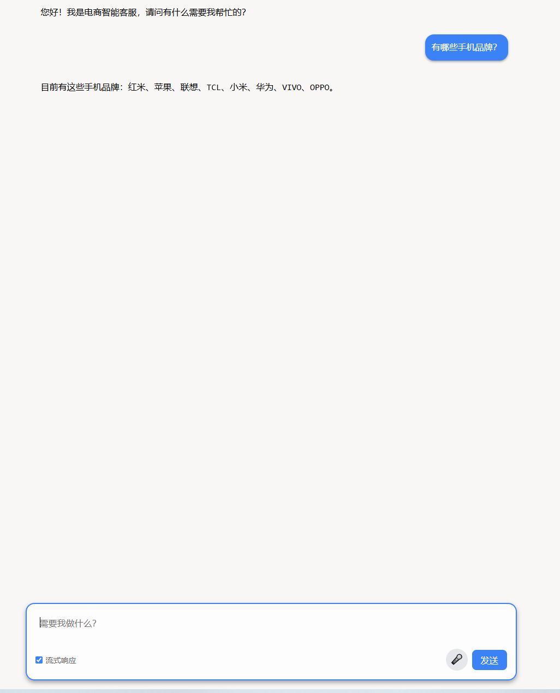
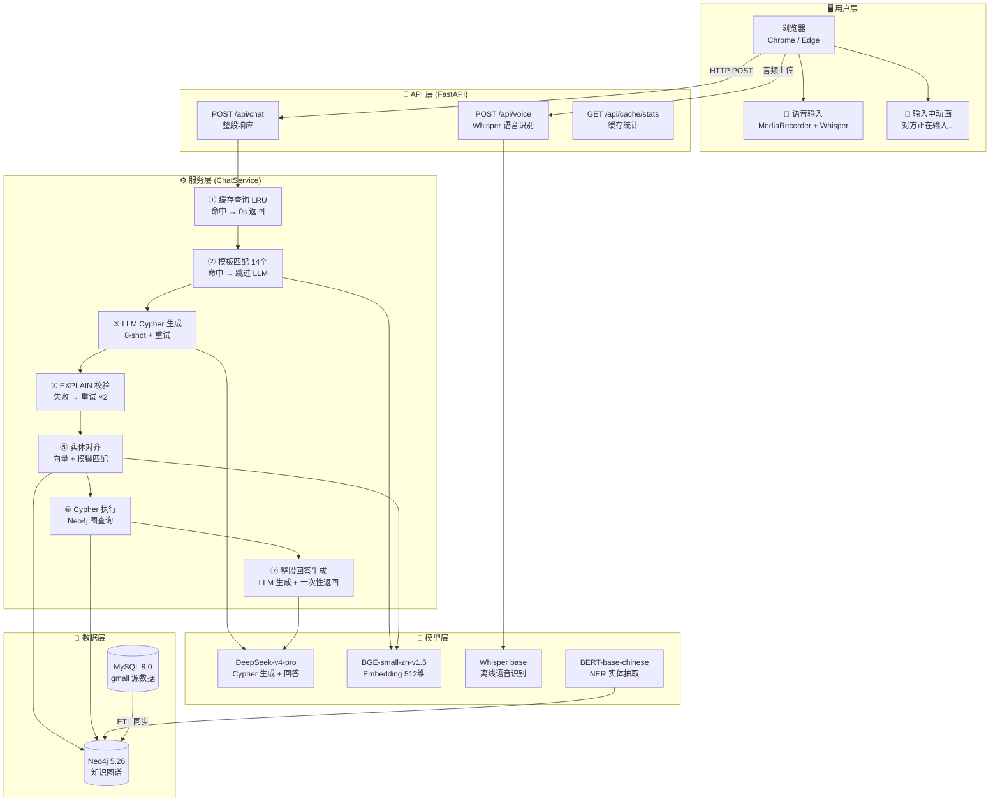
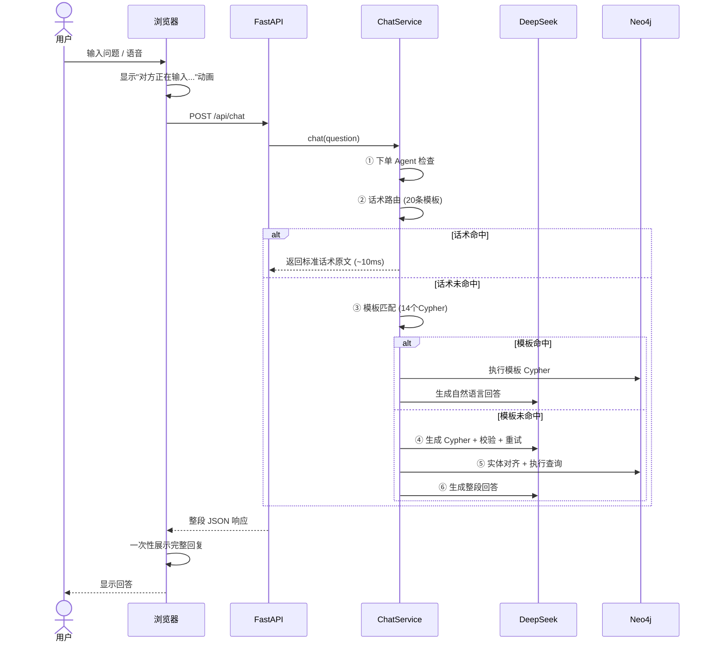
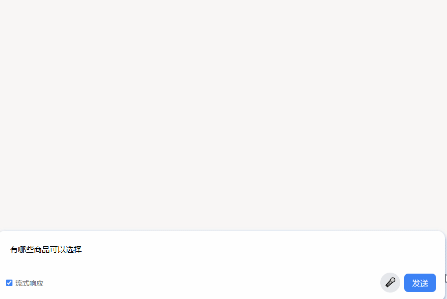
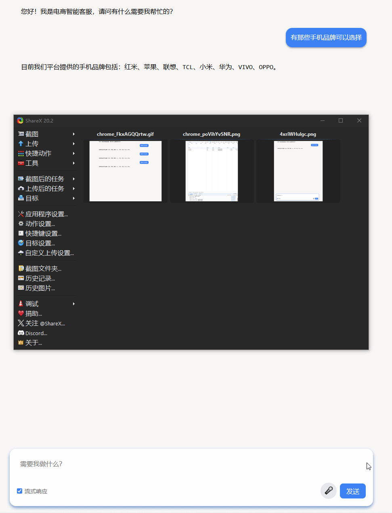

# 🛒 电商知识图谱智能客服系统

> 基于 **知识图谱 + 大语言模型** 的电商智能客服系统 — **人机难辨的 AI 客服体验**。

<p align="center">
  
  <br>
  <sub>💬 电商知识图谱智能客服 — 主界面</sub>
</p>

---

## 📖 项目简介

本项目构建了一个面向电商场景的智能客服系统，以 **Neo4j 知识图谱** 为数据底座，以 **DeepSeek 大语言模型** 为推理引擎，将用户的自然语言问题自动转换为 Cypher 图查询语句，从知识图谱中检索信息，最终生成自然语言回答。

**核心能力**：`自然语言 → Cypher 图查询 → 知识图谱 → 自然语言回答`

### 亮点

- 🤖 **人机难辨**：20 条话术模板直达用户，0% AI 暴露率，回复不露 AI 痕迹
- ⚡ **快速响应**：话术命中 < 10ms；模板匹配 < 2s；LRU 缓存命中 **0s**
- 🎤 **语音输入**：MediaRecorder + Whisper 离线转文字，无需联网
- 🛒 **下单闭环**：识别"帮我下单"意图 → 生成订单卡片 → 模拟下单
- 🛡️ **三级漏斗**：话术路由 → 模板匹配 → LLM 兜底，保障回答质量
- 📊 **评测体系**：115 题标准测试集 + 三模式对比 + 严格/可用双指标

---

## 🏗️ 技术架构

### 系统架构



### 请求处理链路



### 技术栈

| 层级 | 技术 | 说明 |
|------|------|------|
| **后端框架** | FastAPI + Uvicorn | 异步 Web 服务 |
| **LLM** | DeepSeek-v4-pro | 通过 langchain_deepseek 调用 |
| **图数据库** | Neo4j 5.26.9 | 知识图谱存储与查询 |
| **嵌入模型** | BGE-small-zh-v1.5 / 512维 | 本地 CPU/GPU 部署 |
| **NER 模型** | BERT-base-chinese 微调 | Token Classification / BIO 标注 |
| **语音识别** | Whisper base | 离线 STT，无需联网 |
| **前端** | Vanilla HTML/CSS/JS | 零框架，marked.js + DOMPurify |
| **话术路由** | ScriptRouter | 关键词 O(1) + Embedding 兜底，20 条模板 |
| **下单 Agent** | TransactionAgent | 下单意图识别 + 订单卡片 + 模拟下单 |
| **编排框架** | LangChain | LLM / Embedding / VectorStore 统一抽象 |
| **配置管理** | python-dotenv | 环境变量管理密钥 |

---

## 📁 项目结构

```
graph/
├── configuration.py              # 中央配置（env-var 优先）
├── src/
│   ├── datasync/                 # 数据同步模块
│   │   ├── table_sync.py         #   MySQL → Neo4j 结构化同步
│   │   ├── text_sync.py          #   NER → Neo4j Tag 同步
│   │   └── utils.py              #   MysqlReader / Neo4jWriter
│   ├── models/ner/               # NER 模型模块
│   │   ├── train.py              #   BERT 微调训练
│   │   ├── predict.py            #   实体预测/提取
│   │   ├── process.py            #   数据预处理/Tokenize
│   │   ├── eval.py               #   模型评估
│   │   └── metrics/seqeval.py    #   seqeval 指标封装
│   └── web/                      # Web 服务模块
│       ├── app.py                #   FastAPI 入口（4 端点）
│       ├── service.py            #   ChatService 核心（935 行）
│       ├── schemas.py            #   Pydantic 模型
│       ├── utils.py              #   索引创建工具
│       └── static/index.html     #   前端界面（842 行）
├── test.py                       # 简单 curl 测试
├── test_improvements.py          # 6 套件自动化测试（860 行）
└── workflows/                    # Claude Code Workflow
    ├── improvement_workflow.js
    └── improvement_workflow_fixed.js
```

---

## 🚀 快速开始

### 环境要求

- **Python** 3.12+
- **Neo4j** 5.x (Community Edition)
- **MySQL** 8.0+
- **ffmpeg**（语音识别需要，conda 安装：`conda install -c conda-forge ffmpeg -n graph`）
- **CUDA** (可选，GPU 加速)

### 1. 克隆项目

```bash
git clone https://github.com/你的用户名/项目名.git
cd 项目名
```

### 2. 安装依赖

```bash
pip install -r requirements.txt
```

### 3. 配置环境变量

创建 `.env` 文件（**切勿提交到 Git**）：

```ini
# Neo4j
NEO4J_URI=bolt://localhost:7687
NEO4J_USER=neo4j
NEO4J_PASSWORD=你的密码
NEO4J_DATABASE=neo4j

# MySQL
MYSQL_HOST=localhost
MYSQL_PORT=3306
MYSQL_USER=root
MYSQL_PASSWORD=你的密码
MYSQL_DATABASE=gmall
MYSQL_CHARSET=utf8mb4

# DeepSeek API
DEEPSEEK_API_KEY=sk-你的API密钥
```

### 4. 下载模型文件

```bash
# 下载 BERT-base-chinese（放入 models/bert-base-chinese/）
# https://huggingface.co/google-bert/bert-base-chinese

# 下载 BGE-small-zh-v1.5（放入 models/bge-small-zh-v1.5/）
# https://huggingface.co/BAAI/bge-small-zh-v1.5
```

或使用项目中的下载脚本：

```bash
python src/models/ner/download_bert.py
```

### 5. 同步数据

```bash
# 结构化数据同步 (MySQL → Neo4j)
python src/datasync/table_sync.py

# 非结构化数据同步 (NER 提取 → Neo4j)
python src/datasync/text_sync.py
```

### 6. 创建向量索引

```bash
python src/web/utils.py
```

### 7. 启动服务

```bash
cd src/web
python app.py
```

访问 **http://localhost:8000** 即可使用。

---

## 📡 API 文档

| 端点 | 方法 | 响应类型 | 说明 |
|------|------|----------|------|
| `/` | GET | Redirect | 重定向到前端页面 |
| `/api/chat` | POST | `application/json` | 整段问答（含"输入中"动画） |
| `/api/chat?mode=full` | POST | `application/json` | 完整方案（默认） |
| `/api/chat?mode=no_script` | POST | `application/json` | Naive RAG 模式 |
| `/api/chat?mode=llm_only` | POST | `application/json` | 纯 LLM 模式 |
| `/api/chat/stream` | POST | `text/event-stream` | 流式问答 (保留，前端已不使用) |
| `/api/cache/stats` | GET | `application/json` | 缓存统计 |
| `/api/voice` | POST | `application/json` | Whisper 语音转文字 |

### 请求示例

```bash
# 标准问答
curl -X POST http://localhost:8000/api/chat \
  -H "Content-Type: application/json" \
  -d '{"message": "有哪些手机品牌？"}'

# 评测模式（去掉缓存干扰）
curl -X POST "http://localhost:8000/api/chat?mode=full&nocache=true" \
  -H "Content-Type: application/json" \
  -d '{"message": "怎么退货？"}'
```

---

## 🧠 知识图谱 Schema

### 节点类型（10 种）

| 节点 | 数量 | 说明 |
|------|------|------|
| Category1 | 17 | 一级分类（图书、手机、电脑...） |
| Category2 | 113 | 二级分类 |
| Category3 | 1099 | 三级分类 |
| SPU | 20 | 标准产品单元 |
| SKU | 43 | 库存量单位 |
| BaseTrademark | 15 | 品牌 |
| SaleAttr | 15 | 销售属性 |
| SaleAttrValue | 37 | 销售属性值 |
| BaseAttr | 41 | 规格属性 |
| BaseAttrValue | 129 | 规格属性值 |
| Tag | 51 | NER 提取标签 |

### 关系类型（3 种）

```
(SPU)-[:Belong]->(BaseTrademark)    商品 → 品牌
(SPU)-[:Belong]->(Category3)        商品 → 三级分类
(Category1)-[:Has]->(Category2)     一级 → 二级分类
(Category2)-[:Has]->(Category3)     二级 → 三级分类
(SPU)-[:Have]->(SaleAttr)           商品 → 销售属性
(SaleAttr)-[:Have]->(SaleAttrValue) 销售属性 → 属性值
(SKU)-[:Belong]->(SPU)              SKU → 商品
```

---

## ⚡ 性能优化

| 优化层 | 方案 | 收益 |
|--------|------|------|
| 🚀 **缓存** | LRU OrderedDict / 100 条目 | 命中时 **0s** |
| 📋 **模板** | 14 个 Cypher + Embedding 匹配 | 命中时 **1.5-3s**（跳过 LLM） |
| 💬 **话术路由** | 20 条标准话术 + 关键词匹配 | 命中时 **< 10ms**（零 LLM） |
| 🎯 **GPU** | CUDA 自动检测 | 嵌入计算 -0.5~1s |
| 🔍 **索引** | 5 个 Hybrid Search 索引 | 实体对齐加速 |

### 效果对比（115 题评测）

| 指标 | 纯 LLM | Naive RAG | **完整方案** |
|------|--------|-----------|------------|
| 严格正确率 | 59.1% | 70.4% | **71.3%** |
| 可用率 | 93.9% | 98.3% | **99.1%** |
| AI 暴露率 | 6.1% | 1.7% | **0%** |
| 响应时间 | 6.41s | 2.60s | **2.57s** |
| 售后准确率 | ~50% | 87% | **88%** |

---

## 🧪 测试

项目包含两套测试体系：

### API 测试（`test_improvements.py`，860 行）

覆盖流式端点、模板匹配、缓存、错误处理、语音接口、向后兼容 6 个维度。

### 评测框架（`evaluation/`）

- **115 条标准测试集**：商品咨询(40) + 订单查询(27) + 推荐导购(23) + 售后问题(25)
- **三模式对比**：纯 LLM / Naive RAG / 完整方案
- **双指标**：严格正确率（含具体信息） + 可用率（含合理引导）
- **AI 暴露检测**：自动识别"请联系客服"等自曝用词

```bash
# API 测试（需要服务运行）
python test_improvements.py

# 评测（交互标注模式）
python evaluation/evaluate.py

# 评测（自动模式）
python evaluation/evaluate.py --auto

# 评测（三模式对比）
python evaluation/evaluate.py --mode compare
```

---

## 📸 截图展示

### 💬 基础对话界面

<p align="center">
  
</p>

输入自然语言问题，系统自动生成 Cypher 图查询 → 返回结构化回答。

---

### 💬 "对方正在输入..." 动画

<p align="center">
  
</p>

发送消息后显示"对方正在输入..."动画，**模拟真人对话节奏**，不暴露 AI 身份。

---

### ⚡ 缓存命中

<p align="center">
  
</p>

相同问题再次查询，LRU 缓存直接返回，**响应时间 0 秒**。

---

### 🎤 语音输入（GIF）

<p align="center">
  
</p>

点击麦克风录音 → 后端 Whisper 离线转文字 → 自动填入输入框并发送。

---

## 🔮 后续规划

- [ ] 多轮对话记忆（Conversation History）
- [ ] 语义缓存（Semantic Cache）升级
- [ ] 意图路由 Agent（Multi-Agent 协作）
- [ ] 用户反馈机制（👍👎）
- [ ] 分析看板（Dashboard）
- [ ] GraphRAG 增强检索
- [ ] 多模态商品搜索（文本 + 图片）
- [ ] PWA 移动端适配

---

## ⚠️ 安全提醒

- `.env` 文件包含所有密钥，**切勿提交到 Git**
- `apikey.env` 包含 API Key，**切勿提交到 Git**
- 模型文件（`models/`）体积较大，请通过 HuggingFace 下载
- 定期更换 API Key 和数据库密码

---

## 📝 版本历史

### v1.1（当前版本）

- ✅ 新增 **ScriptRouter 话术路由**：20 条标准话术模板，售后/物流/客服等高频场景秒回
- ✅ 新增 **TransactionAgent 下单 Agent**：识别下单意图 → 订单卡片 → 模拟下单闭环
- ✅ 新增 **评测框架**：115 题标准测试集 + 三模式对比 + AI 暴露检测
- ✅ 优化 **前端交互**：去掉流式开关 → "对方正在输入..."动画 → 整段响应
- ✅ 优化 **语音输入**：MediaRecorder + Whisper 离线识别，不再依赖 Google 服务
- ✅ 消除 **AI 暴露**：重写全部话术，不再出现"请联系客服"等自曝用语
- ✅ 评测结果：严格正确率 71.3% | AI 暴露率 0% | 响应 2.57s

### v1.0（初始版本）

- FastAPI + LangChain + Neo4j + DeepSeek 基础架构
- 14 个 Cypher 模板匹配 + 8-shot LLM 兜底
- SSE 流式响应 + LRU 缓存 + Web Speech API 语音输入
- 6 套件自动化测试（860 行）

---

## 📄 License

MIT License — 详见 [LICENSE](LICENSE) 文件。

---

<p align="center">
  <sub>Built with ❤️ using FastAPI + LangChain + Neo4j + DeepSeek</sub>
</p>
